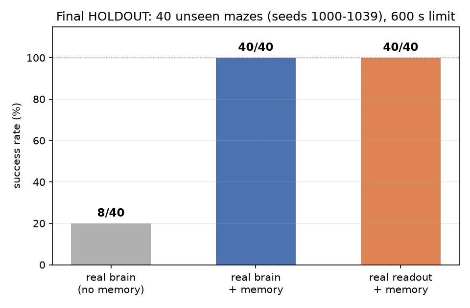
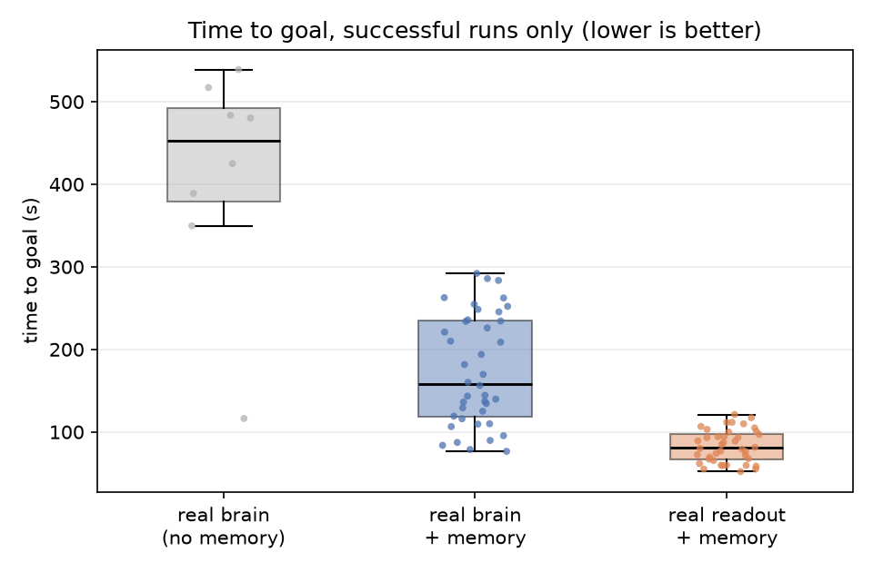
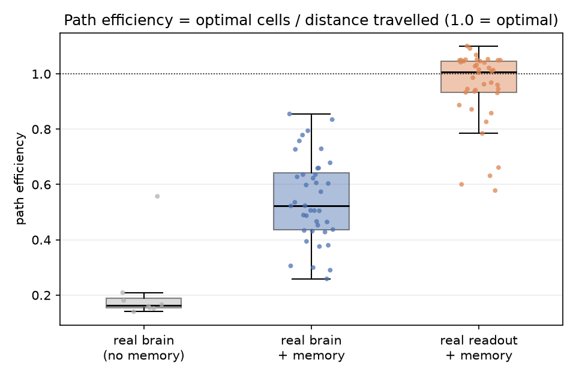
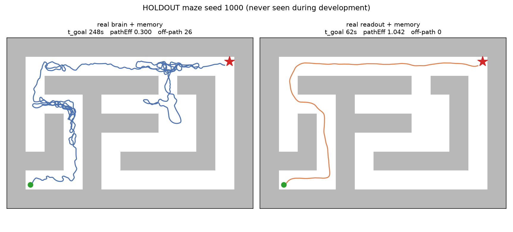

# flybrain-maze

用**果蝇全脑连接组**（MaleCNS v1.0，166,700 神经元 / 25.6M 突触）驱动一辆四驱差速小车，
在未知迷宫里自主导航到给定坐标的终点。

脑是固定的——权重直接来自电子显微镜重建，不做任何训练。可训练的只有出口处的
**线性读出头**（从 1314 个下行神经元读转向指令）。低层转向由连接组负责，高层
"往哪走"由占用栅格 + 目标导向规划负责。

## 快速开始

```powershell
py -3.13 -m venv .venv
.\.venv\Scripts\python.exe -m pip install -r requirements.txt

# 回归自检（17 项）
.\.venv\Scripts\python.exe -m loop.smoke_test

# 真脑 + 记忆 跑一个迷宫（会弹窗）
.\.venv\Scripts\python.exe -m loop.run --brain real --map gen --maze-seed 1000 `
    --maze-cells 6x4 --sim-seconds 600 --memory 1.0

# 真脑 + 群体读出头 + 记忆
.\.venv\Scripts\python.exe -m loop.run --brain real --map gen --maze-seed 1000 `
    --maze-cells 6x4 --sim-seconds 600 --memory 1.0 `
    --mode readout --readout readout_real.npz

# 从 CSV 出图
.\.venv\Scripts\python.exe -m loop.plots --outdir figures
```

---

## 结果

### 最终 HOLDOUT（冻结版本）

**冻结点**：tag `P1-mapfix`，commit `db401f5`。控制器文件（`nav/`、`config.py`、
`loop/decode.py`、`loop/encode.py`、`loop/run.py`）在此之后未改动，由
`--holdout` 自动校验。

**实验设置**：40 个从未运行过的迷宫（seeds 1000–1039，生成规则固定为
`make_holdout_seeds(n=40, base=1000)`，不做难度筛选），`sim_seconds=600`，
`brain_seed=64`，`device=cuda`，每个迷宫跑 1 次。

| 控制器 | 成功 | time to goal | path efficiency | contact ratio | replans | off-path | NO_PATH | 不变量违规 |
|---|---|---|---|---|---|---|---|---|
| real brain（无记忆） | **8/40 = 20%** | 412.5 s | 0.215 | 0.000 | 0 | 0.0 | 0 | 0 |
| real brain + 记忆 | **40/40 = 100%** | 174.5 s | 0.547 | 0.000 | 35.2 | 10.7 | 0 | 0 |
| **real readout + 记忆** | **40/40 = 100%** | **82.7 s** | **0.953** | 0.000 | 17.7 | 1.7 | 0 | 0 |

（time to goal / path efficiency 只统计成功的局。path efficiency 偶尔略大于 1.0，
因为最优路径按**栅格步数**计，而实际路程按**欧氏距离**计——车斜穿拐角时会比
格子计数更短。）





同一张未见迷宫（seed 1000）上两种控制器的轨迹对比：



**结论表述**（刻意保守）：

- 在冻结后首次评估的 40 个未见迷宫上，两种带记忆控制器均达到 40/40；无记忆
  baseline 为 8/40。
- 在本任务和当前控制架构下，加入记忆/规划将 HOLDOUT 成功率从 20% 提高到 100%。
- 读出头对**成功率**没有可测差别（两者都是 40/40），差别在**效率**：平均耗时
  174.5 s → 82.7 s，路径效率 0.547 → 0.953。
- 无记忆 baseline 的 8 个成功里有 5 个耗时超过 400 s（上限 600 s），属于临界成功。

### DEV（开发集）

20 个种子（`DEV_SEEDS`）。**这批已经用于诊断两个 bug，不再是干净的测试集**，
只用于开发期对比。

| 控制器 | 修复前 | 修复后 | time to goal | path efficiency |
|---|---|---|---|---|
| real brain（无记忆） | 3/20 = 15% | 3/20 = 15% | 253.6 s | 0.295 |
| real brain + 记忆 | 9/20 = 45% | **20/20 = 100%** | 156.5 s | 0.577 |
| real readout + 记忆 | 17/20 = 85% | **20/20 = 100%** | 78.7 s | 0.926 |

### Historical（修复前，仅作对照）

以下数字产生于 **occupancy map 状态污染 bug 修复之前**（commit `ba5be73` 及更早），
不能代表当前版本性能，保留仅用于说明该 bug 的影响量级：

| 控制器 | DEV 成功率 |
|---|---|
| real brain（无记忆） | 3/20 = 15% |
| real brain + 记忆 | 9/20 = 45% |
| real readout + 记忆 | 17/20 = 85% |

---

## 方法论

### CUDA 不是逐位确定的

`flybrain` 在 CUDA 上用 cuSPARSE 做稀疏矩阵乘，累加顺序会带来约 1 ULP 的 float32
差异。实测：**166,700 个神经元里有约 280 个膜电位在第 200 步就有 1 ULP 偏差**
（CPU 路径逐位一致）。这个偏差在约 6000 步后会有一个神经元跨过发放阈值，闭环动力学
把它放大，整条轨迹分叉。

因此：

- **单次 CUDA rollout 只是一个随机样本**，不是该配置的结果。
- `loop/benchmark.py` 把两个随机维度**严格分开**：
  - `maze seeds` = 环境泛化（不同迷宫）
  - `reps` = 同一 maze + 同一 brain seed 下的 CUDA 数值非确定性
  - `20 mazes × 5 reps` 报告为 `20x5`，**不当作 100 个独立迷宫样本**
- 每个 rep 完整重建：`brain.reset(brain_seed)` + 新建 Encoder / Decoder（含 Trace
  与重新 load Readout）/ Memory / Car。
- `--check-repro` 自检：CPU 逐位确定，同一 maze seed 跑 N 次统计量必须完全相同。
  当前 **PASS**。
- 汇总口径：先算每个迷宫的 `success_probability = 成功 reps / reps`，再跨迷宫取均值。

最终 HOLDOUT 每个迷宫只跑了 1 次：两种带记忆控制器零失败、零临界（最慢 121 s，
离 600 s 上限很远），因此不需要用 reps 去区分"稳定失败"和"数值不稳"。

### 种子集合

| 集合 | 用途 |
|---|---|
| `TUNE_SEEDS` | 调参 |
| `DEV_SEEDS` | 开发与诊断（已被使用，不干净） |
| `HOLDOUT_SEEDS` | 冻结后一次性最终评估（seeds 1000–1039） |

### 指标定义

| 指标 | 定义 |
|---|---|
| `reached_goal` | 车所在栅格等于终点格 |
| `time_to_goal` | 到达终点所用仿真时间；未到达为 -1 |
| `path_efficiency` | 最优栅格步数 / 实际行驶距离（越接近 1 越好，可略大于 1） |
| `contact_ratio` | 顶墙步数 / 总步数 |
| `replans` | 真正执行规划算法的次数 |
| `off_path_events` | 因明显偏离路径而失效重规划的次数 |
| `no_path_events` | 规划失败**事件**数（状态转换计数，不是每个控制 tick） |
| `invariant_failures` | 地图不变量违规次数，必须为 0 |

---

## 架构

```
world/maze.py      网格迷宫 + DDA 射线投射 + 递归回溯生成器
world/car.py       差速车运动学 + 碰撞

loop/encode.py     射线 -> 感觉神经元注入（按稳态电压增量定义强度）
loop/decode.py     DN 发放率 / 群体读出头 -> (v, omega)，含逃逸、卡死、前方安全限速
loop/run.py        闭环主循环 + 可视化 + 录制 + 统计
loop/benchmark.py  seeds/reps 分离的 benchmark + 元数据
loop/smoke_test.py 17 项回归自检
loop/plots.py      从 CSV 出图
loop/diagnose.py   单局失败诊断（逐秒 trace + 路径失效事件分类）
loop/train_readout.py  采集 + 训练群体读出头（reservoir computing）

nav/memory.py      占用栅格 + 目标导向 Dijkstra + 纯追踪瞄准点 + 路径生命周期
brain/wrap.py      FakeBrain（380 神经元占位）/ RealFlyBrain（MaleCNS 封装）
brain/neurons.py   细胞类型 -> 神经元组
config.py          全部参数 + fake/real 预设 + 噪声配置
```

### 三条信息通路

```
射线 ──> Encoder ──> LPLC2 / LC4 / LC10a ──> 连接组 ──> 下行神经元 ──┐
                        (looming / 逃逸 / 转向)                      │
                                                                     ├─> Decoder ──> (v, ω)
占用栅格 ──> Dijkstra ──> 纯追踪瞄准点 ──────────────────────────────┘
```

- 静态"墙在那边"走 **LC10a**（`LC10a → DNa02` 是已知转向通路）
- 动态"正在逼近"走 **LC4 / LPLC2**（`LPLC2 → DNp01` 逃逸）
- 记忆层只提供"往哪走"的高层偏置，低层转向仍由连接组给出

### 两个已修复的关键 bug

1. **路径生命周期不完整**（commit `ba5be73`）：路径只会在"格子被证实是墙"或
   "到达路径末端"时失效。车一旦跑离路径，两者都不触发，前瞻点涨到 5~9 格，
   而纯追踪增益是 `2·v·sin(err)/L`，L 一大增益就塌（方位误差 162° 时只输出
   0.03 转向），车再也回不来。修法：栅格拓扑 + 连续距离容差的 off-path 检测，
   `wp_idx` 单调前向同步。

2. **占用栅格状态污染**（commit `db401f5`）：射线擦拐角时命中端点会被归到终点格，
   而 `OCCUPIED` 写入是无条件覆盖，于是终点在地图上变成墙，
   `_plan_to_goal` 永远到不了它——规划器**永久死亡**，每个控制 tick 空转重跑同一个
   Dijkstra（实测 8708 次 NO_PATH、9413 次 replans）。修法：终点格不变量 +
   规划器防御 + 通用冲突保护（单次冲突不覆盖已确认 FREE，累积到阈值才翻转）+
   `map_revision` 事件驱动重试。

这两个 bug 都会让 benchmark 数字严重失真，且都只在**未见迷宫**上才暴露出来。

### 附录：CUDA 数值鲁棒性

主 HOLDOUT 每个迷宫只跑了 1 次。为了确认"CUDA 非逐位确定性"不会改变宏观结论，
从 HOLDOUT 里**均匀抽了 8 个种子**（1000/1005/…/1035），每个跑 **3 次**。
不调任何参数，不覆盖主结果，数据另存在 `holdout_robustness.csv`。

| 控制器 | 成功 | 全成功 seed | 全失败 seed | **结果不稳 seed** | t_goal | pathEff |
|---|---|---|---|---|---|---|
| real brain + 记忆 | **24/24 = 100%** | 8 | 0 | **0** | 161.9 s | 0.566 |
| real readout + 记忆 | **24/24 = 100%** | 8 | 0 | **0** | 81.8 s | 0.942 |

逐种子的三次结果：

| seed | real_mem t_goal（3 次） | real_readout_mem t_goal（3 次） |
|---|---|---|
| 1000 | 195.2 / 216.1 / 221.7 | 61.7 / 61.7 / 61.7 |
| 1005 | 220.9 / 220.9 / 220.9 | 89.2 / 89.2 / 89.2 |
| 1010 | 115.9 ×3 | 67.1 ×3 |
| 1015 | 137.2 ×3 | 111.7 ×3 |
| 1020 | 226.0 ×3 | 94.2 ×3 |
| 1025 | 109.9 ×3 | 100.5 ×3 |
| 1030 | 95.4 / 85.9 / 95.4 | 58.4 ×3 |
| 1035 | 181.7 ×3 | 71.6 ×3 |

**观察**：8 个种子里 real_mem 有 6 个、real_readout_mem 有 8 个在三次 rollout 中给出
**完全相同**的统计量。也就是说，1 ULP 的浮点漂移虽然确实存在，但要恰好落在某个
"正在跨发放阈值"的神经元上、且那一刻对控制有影响，才会改变轨迹——在这批种子上
只发生了 2 次，且两次的成功/失败结论都没变。

结论：**CUDA 非确定性在这套设置下没有改变宏观结论**，但它确实存在，所以
"单次 rollout = 一个样本"这条口径仍然保留。

---

## 已知限制

- 传感器是**理想射线**：无噪声、无丢点、无遮挡误差。实物雷达不是这样。
  噪声参数（`NoiseConfig`）已预留但默认全 0，未做鲁棒性测试。
- 里程计是**真值**。实物上需要 SLAM，位姿会漂移，而建图层与规划层都依赖位姿。
- 记忆层假设**终点坐标已知**。这是实验设定，不是探索未知终点。
- 果蝇脑的 `DNg100` 静息时只有 0.25 Hz，模型里**没有"自发前进"指令**，
  所以前进速度靠手工注入 `forward_drive_dv`。这是全项目唯一一处凭空加的信号。
- `turn_sign` 是按"LC10a 是追目标通路、避障要反号"推断的，没有实验依据。
- 迷宫规模有限（6×4 单元 / 26×18 栅格，最优路径约 30–60 格）。更大迷宫的
  规划开销与失败模式未测试。
- 实时倍率约 8x（RTX 4060 Laptop，dt=20 ms）。未在 Jetson 等车载平台上验证。

## 引用

- 连接组数据：MaleCNS v1.0，FlyEM (HHMI Janelia) / University of Cambridge /
  MRC LMB / Google Research，CC BY 4.0。引用 Berg, S. et al. (2026),
  *Sexual dimorphism in the complete connectome of the Drosophila male central
  nervous system*, Cell.
- 仿真框架：[`flybrain`](https://pypi.org/project/flybrain/)（MIT）。
